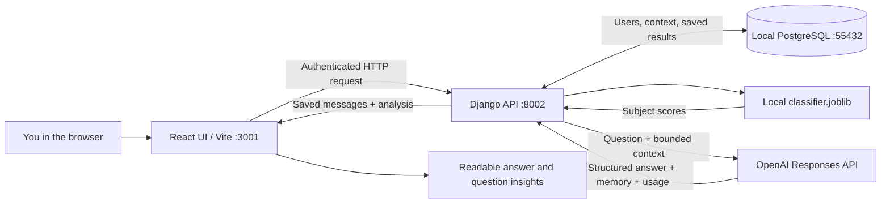
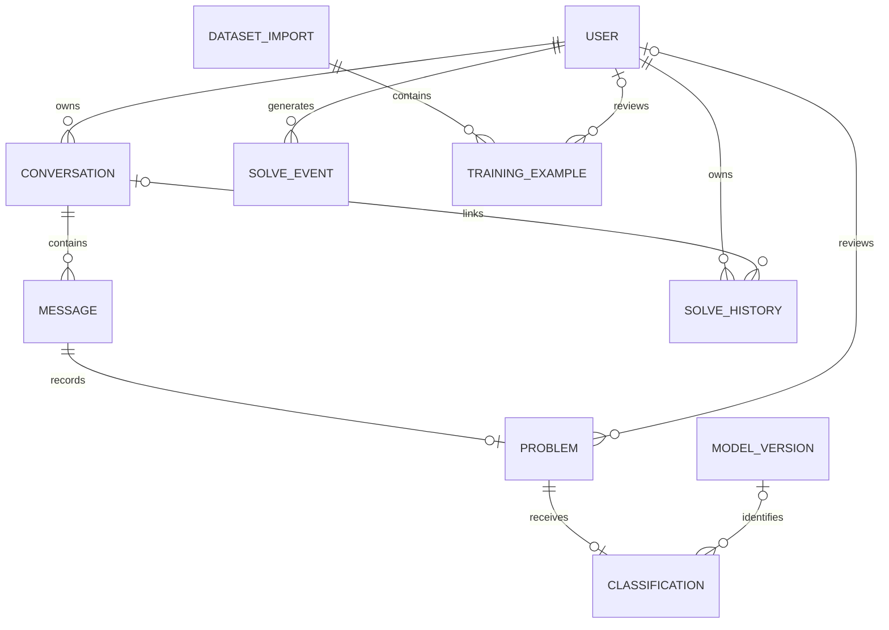
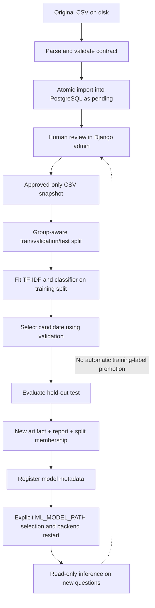

# MathApp — how everything works, and how to explain the data engineering

Reviewed: **21 September 2026**. This document describes the code and local environment at this checkpoint. It separates implemented behavior from future ideas. The current decision is to **keep the application local**; publishing is not part of the plan.

**Repository update — 22 September 2026:** the owner requested committing and pushing the non-sensitive training CSV, model artifact, split membership, reports, and project files to GitHub. This shares repository content; it does not deploy the application. Credentials, live databases, private chats/uploads, and generated dependencies remain excluded. Future data exports must be checked for private information before committing.


## 1. The whole app, explained simply

Imagine a little mathematics school:

- **React is the front desk.** You type a question, see your old conversations, and read the answer.
- **Django is the organizer.** It checks who you are, checks your request, gets the right information, asks for an answer, and saves the result.
- **PostgreSQL is the organized filing cabinet.** It remembers accounts, messages, training examples, predictions, and usage records after you close the browser.
- **The local classifier is the sorting helper.** It tries to put a question into Calculus, Probability, or Discrete Mathematics. It does not solve the mathematics.
- **OpenAI is the remote tutor.** Django sends it the question and selected conversation context. It generates an explanation and answer.
- **The training pipeline is the practice room.** It learns the sorting rules from a separate, labeled dataset. It does not run whenever you send a message.

The technical description is: **a local React/Vite frontend, a Python/Django REST API, a PostgreSQL relational database, a scikit-learn text classifier, and an external OpenAI Responses API integration.**

“Local” means the application servers and database run on your computer. Solving still needs internet access and a paid API account because the tutor is remote. Your dataset is not uploaded to OpenAI for every question.



The arrows to OpenAI are the remote part. The classifier and PostgreSQL are separate things: putting rows into a bigger database does not automatically make a trained classifier better.

## 2. What runs, and where things actually live

### 2.1 Three local processes

| Process | Address in this setup | Job |
|---|---|---|
| Vite development server | `http://localhost:3001` | Serves the React page and forwards `/api` requests to Django. |
| Django development server | `http://127.0.0.1:8002` | Authentication, validation, inference, API calls, database access. |
| PostgreSQL server | `127.0.0.1:55432` | Accepts database connections and manages persistent database files. |

Ports are like different doors on the same computer. The browser door and the database door are not interchangeable. Visiting port 8002 at `/` gives a 404 because Django has no homepage route there; the visible app is on port 3001.

PyCharm is the editor and process launcher. It is not the database. Its Database panel is another client looking inside PostgreSQL. Closing that panel does not delete anything.

### 2.2 Storage locations

| Information | Where it lives | What that means |
|---|---|---|
| Original training CSV | `data/raw/` | A normal file on your disk, kept as the source snapshot. |
| Imported examples, users, chats, operational records | PostgreSQL database `mathapp` | Rows in relational tables. |
| PostgreSQL's physical files | `data/runtime/postgres/` | Database-managed disk files; do not edit them manually. |
| Database connection settings and API key | Private `backend/.env` | Configuration, not training data; never commit it. |
| Local PostgreSQL bootstrap credentials | Private `data/runtime/postgres-config.json` | Used by the local database helper. |
| Reviewed training exports | `data/processed/` | New CSV snapshots exported from approved database rows. |
| Trained classifier | `models/baseline-v1/classifier.joblib` | Learned vocabulary, feature weights, classifier, and metadata. |
| Evaluation and split membership | `models/baseline-v1/report.json` and `splits.json` | Evidence about how that model was trained and evaluated. |
| Browser authentication tokens | Browser `localStorage` | Lets the frontend identify the signed-in user. Not the main data store. |
| Uploaded images/PDFs | Processed during the request | Current flow does not persist the original attachment; successful extracted text is saved. |
| Downloaded conversation | A `.json.gz` download chosen by the browser | A compressed transcript export, not a complete database backup. |

The current database is **local PostgreSQL**, not Neon, not a virtual machine, and not a cloud database. PostgreSQL could run in those other places, but it does not here.

The file `backend/db.sqlite3` is not proof that SQLite is active. Settings use `DATABASE_URL` when configured. Debug mode has a SQLite fallback if that variable is absent. The review verified that the configured live database engine is PostgreSQL.

The CSV and PostgreSQL rows are separate copies with different roles. Editing the CSV does not update PostgreSQL automatically. Editing a database example does not rewrite the original CSV automatically. Import and export commands explicitly move data between them.

## 3. Every main folder and file from the project tree

### `.venv/` — the project's Python toolbox

This contains the Python interpreter and installed Python packages used by MathApp. Django and scikit-learn are installed here. Using this environment keeps MathApp's dependencies separate from other projects.

It is generated, private to the machine, and excluded from Git. It is not where your own application code should go. PyCharm should use `.venv/bin/python`. A model is not trained merely because this environment starts.

### `backend/` — the Python application

**Django** supplies the application structure, configuration, ORM, migrations, users, and admin interface. **Django REST Framework** supplies API request handling, serializers, permissions, and responses.

| Part | What it does |
|---|---|
| `manage.py` | The command entry point: start Django, check configuration, apply migrations, create an admin, import/export data. |
| `math_project/settings.py` | Loads environment settings; selects database, installed apps, authentication, model path, provider settings, and limits. |
| `math_project/urls.py` | Main address book: `/api/auth/`, `/api/solver/`, and `/ms-admin-panel/`. |
| `math_project/wsgi.py` | Standard entry point for a WSGI server to run Django. Local development uses `runserver`. |
| `accounts/serializers.py` | Defines registration input and safe user information returned to the browser. Passwords are write-only. |
| `accounts/views.py` | Registers users when enabled and returns the current user's details. |
| `accounts/urls.py` | Login, registration, token refresh, and current-user routes. |
| `solver/models.py` | Defines conversations, messages, problems, classifications, solve events, and compatibility history. |
| `solver/serializers.py` | Validates solve requests and shapes outgoing conversation/message data. |
| `solver/views.py` | Coordinates an entire solve and exposes chat, classification, reference-answer, export, and statistics APIs. |
| `solver/urls.py` | Connects solver URL paths to those views. |
| `solver/admin.py` | Registers the compatibility solve-history model in Django admin. It does not currently register every new chat table. |
| `solver/migrations/` | Versioned instructions that create and evolve solver database tables and constraints. |
| `datasets/models.py` | Training examples, dataset imports, and model-version metadata. |
| `datasets/admin.py` | Human review of examples; records the authenticated reviewer and time. Provenance records are read-only in the admin editor. |
| `datasets/management/commands/import_training_csv.py` | Validates and imports a CSV atomically, without silently overwriting reviewed data. |
| `datasets/management/commands/export_training_csv.py` | Exports only approved examples to a new CSV snapshot. |
| `datasets/management/commands/register_model.py` | Checks an artifact checksum and records its model-version metadata. Registration does not activate the model. |
| `datasets/migrations/` | Database schema history for training data and model provenance. |
| `core/pipeline.py` | Turns text or extracted attachment text into a task, classifies it, and requests an OpenAI answer. |
| `core/classification.py` | Connects Django settings to local ML inference. |
| `core/mathsolver.py` | Builds the OpenAI request, validates the structured response, and extracts usage. |
| `core/context.py` | Selects recent complete turns and a compact memory for follow-ups. |
| `core/errors.py` | Safe, structured pipeline errors with status codes and optional usage. |
| `core/ocr/easyocr_engine.py` | Active image-to-text implementation. Loads an English EasyOCR reader lazily. |
| `core/ocr/pdf.py` | Extracts an existing text layer from PDFs with pdfplumber. |
| `core/ocr/paddle.py` | Alternative implementation present in code but not selected by the active pipeline. |
| `core/ocr/tesseract.py` | Inactive reference file; its comment about GPT-4o Vision is stale. |
| `.env` | Private local configuration; values intentionally omitted from documentation. |
| `.env.example` | A template describing configuration keys. |
| `requirements-base.txt` | Django, database, API, and core backend package requirements. |
| `requirements-dev.txt` | Adds the testing tools. |
| `requirements.txt` | Adds optional image/PDF processing packages to the base requirements. |

`__init__.py` marks Python packages. Migration `__init__.py` files are structural, not missing implementations. Small `apps.py` files describe Django apps where present.

**Where is the user model?** MathApp uses Django's built-in `User`, stored in `auth_user`. It does not define a separate custom user model in `accounts/`. An administrator is a user with the relevant staff/superuser flags, not a separate kind of database account. The PostgreSQL login used by Django is also different from an app user's login.

### `frontend/` — what you see and click

The frontend uses **JavaScript and JSX with React 18**. JSX describes the page using components. Vite runs the development server and creates a distributable build. CSS and Tailwind style the interface.

| Part | What it does |
|---|---|
| `index.html` | The small starting HTML page into which React mounts. |
| `src/main.jsx` | Starts React and loads the application/styles. |
| `src/App.jsx` | Routes between login, registration, chat, and profile. |
| `src/api.js` | Axios HTTP client; adds the bearer token and handles token refresh. |
| `src/pages/Solver.jsx` | Main chat: conversations, composer, pasted images, uploads, send, history loading, insights, references, and export. |
| `src/pages/Login.jsx` / `Register.jsx` | Account forms and token storage. |
| `src/pages/Profile.jsx` | User/profile statistics screen. |
| `src/components/MathText.jsx` | Renders Markdown and mathematical notation using KaTeX. Rendering an equation is different from understanding it. |
| `src/chat.css` / `src/index.css` | Chat layout, colors, sizing, responsive behavior, and shared styles. |
| `src/components/SolverInput.jsx`, `SolveHistory.jsx`, `SolutionDisplay.jsx` | Older standalone-solver components left in the tree; the current chat page does not import them. |
| `dev/chat-preview.html` / `src/dev/chat-preview.jsx` | Development-only offline UI demonstration using mock API behavior. It is not proof of live OCR/provider behavior. |
| `vite.config.js` | Frontend port and `/api` forwarding to Django on port 8002. |
| `package.json` | Frontend dependencies and `dev`, `build`, `preview` commands. |
| `package-lock.json` | Resolved frontend package versions for repeatable installation. |
| `node_modules/` | Downloaded JavaScript dependencies, generated and Git-ignored. |
| `dist/` | Generated frontend build, Git-ignored; a build does not publish the app. |

React state is temporary screen memory. PostgreSQL is durable application memory. Refreshing the page rebuilds the screen from backend data rather than training the model again.

### `data/` — data at different stages

- `raw/`: original input CSVs; preserve these so you can investigate or reproduce an import.
- `processed/`: approved exports prepared for later training. The folder existing does not mean all examples have been reviewed.
- `runtime/`: the running PostgreSQL cluster, private local configuration, socket directory, and database log.
- `samples/`: sample PDFs, screenshots, and JSON retained from the original prototype. `samples/jason/` is an inherited folder name for JSON examples.
- `uploads/`: configured as Django's media location, but the active solver does not save incoming image/PDF files there.

These have different lifecycles. A raw dataset is source evidence; runtime database files are live state; a sample PDF is a demo asset. Mixing them makes backup, deletion, and reproducibility harder.

### `docs/` — the project's memory for humans

| Document | Purpose |
|---|---|
| `work-log.md` | What changed, why, what was checked, and outstanding work at each checkpoint. Older entries are historical. |
| `data-model.md` | Schema, ownership, review separation, and data lifecycle. |
| `training.md` | Dataset/training commands, splits, model metrics, and limitations. |
| `chat.md` | Chat behavior, compact context, exports, and operational limits. |
| `pycharm.md` | Local IDE/run configuration and testing steps. |
| `hosting-plan.md` | Earlier hosting discussion. Historical reference now that local-only use is chosen. |

This root `details.md` is the longer learning and interview guide that connects those pieces.

### `legacy/` — the old prototype kept for reference

This contains earlier `agent`, `django`, `deepseek`, OCR/converter modules, camera scripts, and standalone pipelines. Active code lives outside this folder. A function in `legacy/agent/normalization.py` does **not** mean the active classifier normalizes informal mathematics that way.

Moving old code here makes the supported path clearer without deleting the historical work. It should not be described as a second running backend or an active DeepSeek dependency.

### `ml/` — code that builds and uses the small classifier

The installable package is `ml/src/mathapp_ml/`:

- `data.py`: CSV contract validation, identity hashes, dataset audits, and group construction.
- `training.py`: group-aware splitting, feature extraction, candidate fitting, evaluation, and artifact writing.
- `inference.py`: cached loading of a trusted artifact, score generation, and uncertainty decisions.
- `cli.py`: the `mathapp-ml audit`, `train`, and `predict` terminal commands.

The `src` structure separates installable code from repository files. Generated `.egg-info` metadata, if visible, belongs to packaging and can be recreated.

### `models/` — trained output, not Django source models

The word “model” has two meanings here:

1. A **Django model** describes a database table in a `models.py` source file.
2. An **ML model** is a learned classifier saved in `models/baseline-v1/`.

That version folder holds `classifier.joblib`, `report.json`, and `splits.json`. The training command refuses to overwrite an existing candidate folder. These non-sensitive baseline artifacts are tracked in Git under the owner's 22 September instruction, so another checkout can obtain the same candidate.

### `reports/` — reserved report output

Currently a reserved folder with `.gitkeep`. Baseline evaluation is actually under `models/baseline-v1/report.json`. Do not claim a monitoring dashboard or reporting pipeline exists merely because this folder exists.

### `scripts/` — local utilities

`local_db.py` initializes, starts, stops, or checks this project's PostgreSQL cluster. It generates a private password, listens on loopback, and refuses initialization over an existing cluster or `.env`. It is not a backup tool, migration tool, or training pipeline.

### `tests/` — checks that protect behavior

| Test module | Main coverage |
|---|---|
| `test_data.py` | CSV parsing, invalid rows, duplicate questions, grouping, mathematical character preservation, and training review gates. |
| `test_database.py` | Import retries, rollback, dry runs, constraints, approved-only exports, message sequence uniqueness, and reviewer attribution. |
| `test_inference.py` | Cached loading, uncertain predictions, package-version mismatch, and experimental-model restrictions. |
| `test_api.py` | Ownership, authentication, original text preservation, failures, and ordered conversation writes. |
| `test_chat.py` | Follow-ups, bounded memory, leases, references, compressed export, and mocked attachment/provider paths. |
| `test_openai_solver.py` | Request shape and server-side configuration with mocked OpenAI calls. |

Tests use a separate test database. They do not train on your private chats or spend money on real OpenAI calls. Passing an attachment mock test does not prove that the actual OCR dependencies are installed.

### Root files and PyCharm-only entries

| Item | Meaning |
|---|---|
| `.gitignore` | Keeps secrets, environments, private user data, and database runtime files out of normal Git tracking. Non-sensitive training datasets and model artifacts are tracked. Ignore rules are not encryption and cannot erase older Git history. |
| `AGENTS.md` | Instructions for future coding sessions: scope, data rules, and verification. |
| `README.md` | Short project introduction and commands. |
| `pyproject.toml` | Python package metadata, ML dependencies, CLI entry point, and pytest settings. |
| `requirements-local.lock` | Pinned Python environment used for the verified local workflow. |
| `uv.lock` | Another dependency resolution, currently inconsistent with the backend Django pin; see unfinished work. |
| `.idea/`, if present | Local PyCharm project/run settings; Git-ignored. |
| External Libraries | PyCharm's view of installed dependencies, not an application folder you wrote. |
| Scratches and Consoles | PyCharm's temporary experiments/consoles, not deployed application code. |
| `.gitkeep` | An empty marker used to keep an otherwise empty directory in Git. |

## 4. The full cycle: from your click to OpenAI and back

### 4.1 Signing in

1. React shows the login form.
2. It sends username/password to `POST /api/auth/login/` through Vite's proxy.
3. Django's authentication checks the user and stored password hash. Passwords are not stored as readable text.
4. The JWT login endpoint returns access and refresh tokens.
5. The browser stores those tokens. `api.js` adds `Authorization: Bearer ...` to later API requests.
6. React asks `/api/auth/me/` who is signed in and requests that user's conversations.

The frontend's route guard is only a convenience. Real access control is enforced by Django. Knowing another conversation ID does not give you permission to read it.

Django admin uses its own normal session/cookie login. A superuser created with `createsuperuser` is stored in the same user table and can also sign in through the application.

### 4.2 Sending a text question

Example: **“Find the limit of 1/x as x approaches infinity.”**

1. You type into the composer. React temporarily holds the text.
2. Enter or Send calls `send()` in `Solver.jsx`. A local lock prevents immediate duplicate submissions from that page.
3. The browser sends a small JSON body. For a follow-up it includes the existing conversation ID:

   ```json
   {"content":"Why does that approach zero?","conversation_id":42}
   ```

   `42` is an invented example ID. The browser does not resend the whole transcript or include an API key.

4. Vite forwards `/api/solver/solve/` to Django. `urls.py` selects `SolveView`.
5. Django authenticates the bearer token. The solve endpoint applies a six-per-minute per-user throttle.
6. The serializer checks the request: allowed input type, nonempty text, and text length up to 20,000 characters.
7. For an existing conversation, the view verifies ownership and attempts to claim a temporary lease. If another request already owns it, the request gets a 409 response before another provider call.
8. `build_context()` fetches a bounded tail of the stored conversation. It builds recent complete turns, optionally with a compact memory snapshot.
9. `core/pipeline.py` prepares the current task. `core/classification.py` calls the local classifier using **this task's text**. The classifier does not read all previous messages.
10. The classifier loads its trusted `.joblib` file on first use in the process, then reuses the cached object. It returns subject scores, uncertainty, and model version.
11. `core/mathsolver.py` obtains a process-local OpenAI client using the backend's private key.
12. Django sends one Responses API request: tutor instructions, selected history/memory, and the current task. The local classification is not currently inserted into that prompt and does not route the request to a cheaper model.
13. The request asks for structured JSON with `is_math`, `answer`, `subject`, `final_answer`, and `memory`. It sets an output limit, configured reasoning effort, and `store=False`. MathApp manages conversation state in its own database; this setting is not a blanket statement about provider data-retention policies.
14. The OpenAI service generates a reply. This remote model performs the tutoring; the local classifier does not.
15. Django checks response completion and validates the JSON against `MathReply`. Malformed, incomplete, or unrelated replies are handled as failures rather than successful saved solutions.
16. Django reads token counts supplied by the provider. Missing counts remain unknown rather than becoming invented zeros.
17. A database transaction creates/updates the conversation, saves the user message and problem, saves the local classification, saves the assistant message and memory, writes compatibility history, and records the successful usage event.
18. For an existing conversation, row locking and the lease check protect ordered writes. The lease is released afterward, including on handled failures.
19. Django returns the saved message pair, conversation ID, and analysis. It leaves the private memory snapshot out of the public solve result.
20. React appends the returned messages and refreshes the conversation list. `MathText.jsx` renders Markdown and LaTeX. The insights panel shows the classifier scores, OpenAI's assessment, any reviewed reference answer, and usage/context information.

This is a normal request/response flow. The answer arrives when generation completes; the current implementation does not stream individual generated tokens to the page.

### 4.3 What happens on a follow-up?

For “why?”, Django reconstructs useful context from saved messages. OpenAI can therefore explain the earlier answer. The local classifier still sees the current task alone and may be uncertain about “why?”. Those two components have different inputs and capabilities.

The conversation ID is a pointer to your database records. It is not a continuously running model, an OpenAI session object, or a promise of unlimited memory.

### 4.4 What happens with Ctrl+V, an image, or a PDF?

1. Pasting an image creates a local attachment preview. Ordinary text/LaTeX still pastes as text.
2. Nothing is uploaded until Send. One image/PDF is supported per request, up to 10 MB.
3. The browser sends the file and optional caption using multipart form data. It does not expand the file into a base64 JSON string in the current UI.
4. For an image, OpenCV decodes it and EasyOCR extracts English text. For a PDF, pdfplumber reads its text layer, with a 20-page limit.
5. Extracted text and the caption become the task and go through classification and solving.
6. A successful turn stores the task text. The original attachment is not retained, and later follow-ups use stored text rather than repeatedly uploading the file.

**Current limitation:** EasyOCR, OpenCV, and pdfplumber are missing from the reviewed `.venv`. Text chat can run while these optional inputs fail. A scanned PDF also needs an OCR fallback that is not implemented. The current image pipeline sends extracted text to OpenAI, not the image itself.

### 4.5 Failure behavior

Invalid input can stop at validation. Unauthorized access stops before solving. A missing API key returns a safe “not configured” error. Provider failures return safe messages rather than exposing provider exception details to the browser.

Handled pipeline failures create an operational failure event. They do not create a successful answer or append the failed turn to the conversation. Some early failures, such as serializer rejection or a busy lease, do not create a `SolveEvent`.

Database writes are atomic with each other, but they cannot undo a completed external API request. If the provider returns a billable result and the database write then fails, MathApp can have a cost without a saved answer. This limitation matters when discussing transaction boundaries.

## 5. Data engineering: the four different kinds of data

A good data system first decides what each record means. In MathApp there are four main categories:

| Category | Example | Trust level and purpose |
|---|---|---|
| Source/training data | A CSV question labeled CALCULUS | A proposed labeled example; synthetic rows need review. |
| Operational application data | User, conversation, message, extracted problem | Records what happened in the application. |
| Predictions and generated content | Classifier scores and OpenAI answer | Model output, which can be wrong. |
| Human-reviewed data | Approved training example or reviewed reference answer | Explicit review with a reviewer and timestamp; still subject to human error. |

**These are not interchangeable.** A model saying “Calculus” must not silently become the correct training label. Otherwise the model can reinforce its own mistakes.

Also distinguish the two review flows: reviewing a chat reference answer updates `Problem`; reviewing a training row updates `TrainingExample`. There is no implemented automatic promotion from one to the other.

Interview wording: “I separated operational data from curated training data and kept predictions separate from human-reviewed labels. That makes the source and trust level of each value explicit.”

## 6. The database schema, table by table

### 6.1 Basic vocabulary

A **table** is an organized list of one kind of thing. A **row** is one thing. A **column** is a property. A **primary key** identifies a row. A **foreign key** points to a row in another table and enforces that the referenced row exists.

For example, a conversation's `owner_id` points to a user. A message's `conversation_id` points to a conversation. We do not repeat a username and password on every message.



This is a simplified relationship diagram, not all Django system tables. `ModelVersion.dataset_sha256` records a training-file fingerprint; it is not a foreign key to `DatasetImport`.

### 6.2 `auth_user` — accounts

Stores username, password hash, email, timestamps, and staff/superuser flags. `create_user()` hashes passwords. `createsuperuser` creates an account; migrations only create the schema, so a newly migrated database can correctly contain zero users.

Django also creates tables for groups, permissions, group/user relationships, sessions, content types, migration history, and admin actions. These support the framework. `django_admin_log` is not an immutable audit of all database changes.

### 6.3 `datasets_datasetimport` — the receipt for a source file

Key columns: `id`, `filename`, unique `sha256`, `row_count`, `created_at`.

This says, “We imported these exact file bytes at this time.” SHA-256 is a fingerprint used for identity/integrity checking, not encryption. Changing a byte changes the fingerprint. `row_count` is the original import count, not the current number of approved rows.

Keeping this receipt lets us trace an example back to its imported source. The original file remains on disk; the table does not store the full CSV bytes.

### 6.4 `datasets_trainingexample` — candidate and reviewed examples

| Column | Meaning |
|---|---|
| `id` | Internal database primary key. |
| `external_id` | Unique stable ID from the CSV. |
| `dataset_id` | Which import produced the row. |
| `question` | The mathematical task text, not an AI answer. |
| `content_hash` | Unique SHA-256 of the normalized question identity. |
| `label` | CALCULUS, PROBABILITY, or DISCRETE. |
| `subtopic` | More specific description such as limits. |
| `language` | Supported contract values `en` or `mk`; this is metadata, not proof of model performance in both languages. |
| `source` | Source/provenance description, currently synthetic in the baseline. |
| `group_id` | Related template family used to help keep similar examples in the same split. |
| `review_status` | Pending, approved, or rejected. |
| `reviewed_by_id`, `reviewed_at` | Who reviewed the row and when. |
| `created_at`, `updated_at` | Creation and latest update times. |

Database constraints restrict labels, statuses, languages, empty questions, duplicate identities, and unattributed review. A non-pending example must have a reviewer and review time. Imports always set pending even when the CSV claims approval.

An index on `(review_status, label)` helps the common reviewed-data access pattern. `group_id` is also indexed. Unique fields have indexes supporting uniqueness/lookups.

### 6.5 `datasets_modelversion` — a model's identity card

Stores unique version name, artifact path, artifact checksum, training-file checksum, evaluation metrics as JSON, experimental status, and creation time.

This supports the question: “Which artifact and training snapshot produced that prediction?” `Classification` keeps a model version string and can link to this registry record.

The registry records provenance. Runtime activation still comes from `ML_MODEL_PATH`. Registration verifies the artifact against its report, but runtime loading does not currently re-check the checksum against the registry.

### 6.6 `solver_conversation` — a notebook belonging to one user

Stores owner, title, created/updated times, and a temporary `busy_until`/UUID `lease`. The lease is for coordinating generation; it is not a token or the conversation's content.

A new conversation is created when the first solve succeeds. An empty new-chat screen alone does not create a saved conversation.

### 6.7 `solver_message` — one entry in the notebook

Stores conversation ID, sequence number, role, full content, analysis JSON, derived memory, and creation time.

- Role is `user` or `assistant`.
- `(conversation_id, sequence)` is unique, so two messages cannot occupy the same position.
- Message content must not be empty after the database's trim check.
- `content` preserves the successful turn; `memory` is a separate derived summary.
- `analysis` holds the UI's prediction/provider/usage/context snapshot.

Sequence gives an explicit order without assuming timestamps are unique. A new successful pair gets consecutive positions, starting at zero.

### 6.8 `solver_problem` — the actual task associated with a user message

One problem links to one message. It stores complete prepared task text and its input type. It also stores an optional reviewed reference answer, reference label, reviewer, and review time.

Why separate message and problem? A typed message can preserve its original formatting while the task is stripped/prepared for processing. With an attachment, the extracted text is the task. This gives the classification a clear object to refer to.

The reference-edit API requires a staff user who owns that conversation. It does not automatically verify the OpenAI answer or add a training example. Reference fields have less comprehensive database-level validation than the curated training table; this is a remaining improvement.

### 6.9 `solver_classification` — what the local model predicted

One prediction record per problem: predicted label, score JSON, uncertain flag, version string, optional registry link, and timestamp. A database check allows the three supported subjects or UNKNOWN.

An uncertain prediction can retain scores showing Calculus on top while its final label is UNKNOWN. This is deliberate abstention. Predictions are not human truth.

### 6.10 `solver_solveevent` — operational metadata

Stores user, success/failure status, safe error code, provider/model, timestamp, and nullable token counts: input, output, reasoning, cached input.

It intentionally avoids copying full prompts, API keys, or raw provider errors. It supports aggregate monitoring. It currently has no conversation/message/request foreign key, dollar amount, or durable request-id reconciliation, so it is not a complete billing ledger.

### 6.11 `solver_solvehistory` — compatibility with the original app

Stores user, optional conversation, task, solution, domain, input type, OCR label, and time. New successful solves write this as well as the newer chat tables because history/statistics compatibility remains.

This duplication is a conscious transition cost, not perfectly normalized storage. Task/answer data exists in multiple places. Removing the duplicate requires migrating its consumers and deciding how to preserve old history.

### 6.12 Why relationships and deletion rules matter

Many operational relationships use CASCADE: deleting a parent can remove dependent rows. Dataset/model/reviewer relationships use PROTECT where losing provenance would be harmful; a reviewed problem's reviewer uses SET_NULL.

There is not yet a complete user-facing deletion/retention workflow. Do not claim that deleting a user always succeeds or erases every related artifact: protected review references can prevent deletion, and disk files have their own lifecycle.

## 7. The dataset pipeline, step by step



The dotted relationship represents a **possible future review workflow**, not an implemented chat-to-training transfer. Currently training examples are imported through CSV.

The current experimental baseline took an explicit shortcut: it was trained directly from the pending synthetic CSV using `--include-pending`. It did not pretend that the 1,000 rows had been human-approved.

### 7.1 Start with a data contract

The exact CSV header is:

```csv
id,question,label,subtopic,language,source,group_id,review_status
```

An invented example, not a copied private record:

```csv
demo_calc_01,"Find the limit of 1/x as x approaches infinity.",CALCULUS,limits,en,manual_demo,reciprocal_limit,pending
```

The contract requires the expected columns in order, valid IDs, nonblank fields, allowed labels/statuses/languages, field-length limits, and no NUL characters. Proper CSV parsing handles quoted commas and Unicode; splitting each line on commas would corrupt valid questions containing commas.

This is **schema validation**: check whether a record fits the expected shape and permitted values. It cannot establish whether a calculus label is mathematically correct. That needs semantic review.

### 7.2 Validate before changing the database

`load_csv()` reads and validates the file. It reports row-number diagnostics without dumping the full questions. If validation finds errors, import does not proceed. A dry run validates and checks database conflicts without writing.

For 1,000 rows, reading the input into memory is a reasonable simple design. This is not a large-scale streaming importer; millions of rows would need a different ingestion strategy.

### 7.3 Detect three different kinds of duplication

1. **Same external ID:** the same source identity appears twice.
2. **Same normalized question:** different IDs contain the same question apart from identity-normalization differences such as extra whitespace.
3. **Related template:** tasks differ in numbers or belong to a declared family. They are not necessarily duplicates to delete, but should be grouped for evaluation.

The first two are rejected by validation/uniqueness rules. The third helps prevent evaluation leakage.

### 7.4 Preserve mathematical meaning during identity checks

Identity normalization uses Unicode **NFC**, collapses whitespace, and strips outer whitespace. It preserves variable case and meaningful superscripts. For example, `x²` must not become `x2`, and `P(X)` should not be silently made identical to `p(x)` for deduplication.

Do not confuse this with three other operations:

- CSV field trimming removes surrounding whitespace from fields when importing.
- Template fingerprinting case-folds text and replaces numbers with a marker to identify related shapes; it is a grouping heuristic, not the stored question identity.
- The current TF-IDF vectorizers use their default lowercase feature processing. Preserving original text does not mean every ML feature preserves case.

This distinction is a strong interview point: **a representation suitable for deduplication is not necessarily the same representation suitable for learning or display.**

### 7.5 Import idempotently and atomically

The importer computes a checksum over the complete file bytes. If that exact file was imported already, a repeat import is a no-op. This is the implemented form of **idempotency**.

If a different file conflicts with existing external IDs or normalized questions, the importer rejects it instead of silently updating reviewed data. The code is an insert pipeline, not a general upsert/synchronization system.

Inside one database transaction it creates the import receipt and all training rows. Either all those writes commit or they roll back. Database unique constraints protect against conflicting inserts even if application pre-checks race.

Limits: two simultaneous imports of identical bytes can result in one success and one constraint error rather than two pleasant no-op responses. Re-importing the same bytes also does not reset a row that was later edited by a reviewer. Those behaviors follow from protecting the existing curated state.

### 7.6 Record trustworthy review metadata

The CSV is untrusted as a claim of human review. Even a row marked `approved` in an incoming file is imported as pending. The authenticated admin review action supplies reviewer identity and timestamp.

The database enforces attribution for non-pending examples. This prevents a normal write path from creating an approved row with no accountable reviewer.

There is no full revision history of each question/label edit yet. The current row records latest state, and the preserved raw file records original input. That is useful provenance but not a complete immutable change log.

### 7.7 Export a training snapshot

The export command selects approved rows, orders them by external ID, and writes a new CSV. It refuses to overwrite an existing output filename. It does not export private chat conversations.

The trainer consumes that CSV file, not a live database cursor. This separates the application database from a repeatable training input. The artifact report records the exact training-file checksum.

Export limitations: it does not yet use a repeatable-read snapshot transaction or temporary-file-plus-atomic-rename publication. Concurrent edits or a disk failure could complicate reproducibility. For a small, manually operated local pipeline, coordinate exports when reviews are not running; stronger snapshot publication is future work.

### 7.8 Keep related examples out of different splits

Suppose training contains “Choose 2 objects from 6” and testing contains an almost identical “Choose 3 objects from 8.” A random row split can exaggerate how well the model handles genuinely new question styles.

MathApp joins examples sharing a declared `group_id` or a numeric-template fingerprint. The grouping is transitive: if A is related to B and B to C, all stay together. `StratifiedGroupKFold` then tries to preserve class proportions while keeping groups separate.

The current audit found 1,000 effective groups for 1,000 rows. That means the implemented heuristic did not merge them; it **does not prove the dataset has no semantic paraphrases**. Better family metadata and semantic review remain valuable.

### 7.9 Keep test data out of fitting and model selection

The baseline split is:

| Partition | Rows | Role |
|---|---:|---|
| Training | 599 | Fit vocabulary, TF-IDF weights, and classifier weights. |
| Validation | 201 | Compare candidate settings and choose one. |
| Test | 200 | Evaluate the chosen candidate after selection. |

The code uses deterministic seeds 42 and 43 and two candidate regularization settings, `C=0.5` and `C=2.0`. Selection uses validation macro F1. It saves the selected fitted candidate rather than fitting feature extraction on the whole dataset before splitting.

Why this matters: learning vocabulary/statistics from the test set would leak information even if you hid its labels. Keeping preprocessing inside the training pipeline avoids that particular leakage.

## 8. How the classifier actually learns

The classifier is **TF-IDF plus logistic regression**, not a large language model or symbolic mathematics parser.

1. Word TF-IDF looks at words and adjacent word pairs.
2. Character TF-IDF looks at small text fragments of 2–5 characters, helping capture some notation and spelling patterns.
3. TF-IDF makes numerical features: common terms are weighted differently from more distinctive terms. Sparse matrices avoid storing every absent feature as a dense zero.
4. Logistic regression learns weights connecting those features to the three labels. Balanced class weights are configured.
5. At inference, the stored pipeline converts a new question into the same feature space and returns class scores.

Feature limits are 30,000 word features and 50,000 character features; terms must appear in at least two training documents. The actual learned vocabulary can be smaller.

Only `question` becomes input features. `label` is the supervised target. `subtopic`, source, group IDs, review flags, answers, and external IDs are not included as predictive inputs. Otherwise the model might learn shortcuts it would not have when a real user asks a question.

### 8.1 What the actual baseline achieved

The saved report records:

- 1,000 English synthetic examples: 333 Calculus, 333 Probability, 334 Discrete.
- All 1,000 were pending, so this is an experimental candidate.
- Held-out top-label accuracy: **193/200 = 96.5%**.
- Held-out macro F1: approximately **0.9651**.
- Correct predictions by actual class: Calculus 67/67; Probability 65/66; Discrete 61/67.

Accuracy is total correct divided by total evaluated. Precision asks whether predicted members of a class really belong there. Recall asks how many real members were found. F1 combines precision and recall; macro F1 gives each class equal weight.

Those metrics apply to this synthetic held-out set and the raw top predicted labels. They do not measure mathematical solution correctness, real-user accuracy, calibrated confidence, or the behavior after uncertainty rejection.

### 8.2 Why “55.1%” can display as uncertain

The initial inference rules require a top score of at least 60% and a lead over the second score of at least 15 percentage points. An input with no recognized features is also uncertain.

At 55.1%, the threshold fails even if Calculus has the highest score. The stored label becomes UNKNOWN while the score chart remains visible. This is not evidence that PostgreSQL corrupted the question.

The score is uncalibrated. It is not “55.1% of the answer is right” or a measured probability that this individual classification is correct.

Prior local diagnostics recorded large differences between shorthand, formal LaTeX, and explicit English. For example, `lim x-> inf 1/x` scored about 44.7% for its top class, while an equivalent tested LaTeX formulation scored about 91%. Those are examples of representation sensitivity, not a new measured accuracy benchmark.

### 8.3 What still needs improvement

There is no active semantic parser converting “x down goes to inf, one above x” into a verified mathematical expression. The frontend can display LaTeX; that does not mean the local classifier understands spatial descriptions. OpenAI may understand them better because it is a different model.

A sensible future experiment is to create a small reviewed real-input evaluation set, collect shorthand/typo/LaTeX variants with shared family IDs, and test conservative notation normalization applied identically in training and inference. Preserve originals and never guess ambiguous parentheses or limits silently.

Do not lower the threshold just to make the word “Uncertain” disappear. Evaluate accuracy, abstention rate, and calibration on independent reviewed data. Larger data volume helps only when labels, coverage, diversity, and evaluation are good.

### 8.4 Does the model learn from every message?

**No.** Inference uses fixed learned weights. Saving another message adds database rows but does not change the artifact. A safe learning cycle would collect candidate examples, review them, build a new snapshot, retrain, evaluate, and explicitly activate a new version. The automatic chat-to-review pipeline is not implemented.

Loading the artifact once per Django process already avoids repeated loading for every question. Restarting the process means loading it again on first inference. Docker would package the environment; it would not preserve process memory through restarts or make retraining unnecessary.

## 9. Transactions, constraints, ordering, and indexes

### 9.1 Application validation plus database constraints

The serializer/parser gives friendly early errors. The database supplies a final integrity boundary. Both are useful because an admin command or concurrent process can bypass a particular API serializer.

Examples implemented here: unique training IDs/content hashes, valid class/status values, required reviewer attribution, and unique message positions within a conversation.

Do not overstate this: Django `save()` does not automatically run every model's `full_clean()`, and bulk operations bypass `save()`. The importer explicitly computes hashes because it uses `bulk_create`. JSON score internals and reference-answer metadata do not yet have equally strong database checks. Database trim checks also are not a complete validator for every possible whitespace character.

### 9.2 ACID, with a concrete example

- **Atomicity:** importing the receipt and 1,000 examples succeeds together or rolls back.
- **Consistency:** keys/check constraints prevent invalid committed states covered by those rules.
- **Isolation:** concurrent transactions are coordinated; chat saving uses row locks and a lease to protect sequence assignment.
- **Durability:** committed database changes survive an ordinary application restart. Durability is not a substitute for a backup if the disk is lost.

The OpenAI request is outside the database transaction. Holding a row lock during a slow network call would keep a transaction open unnecessarily. A short claim/update establishes a lease before the call, followed by a short transaction to save the result.

The lease lasts ten minutes for an existing conversation and is released by its owner. It reduces overlapping paid calls within that conversation. It does not provide end-to-end exactly-once billing or eliminate retries after network uncertainty.

### 9.3 Indexes are shortcuts with a cost

Primary/unique keys and Django foreign keys provide useful indexed access. Explicit indexes include training review-status/label, group ID, and solve-event time. These match tasks such as selecting reviewed examples, following relationships, and examining operational records.

An index uses storage and adds work on writes. Do not add one to every column without evidence. At larger scale, inspect query plans and add an index matching actual slow filters/orderings; current code has not undergone a large-volume load benchmark.

### 9.4 Relational columns and JSON have different jobs

Stable relationships and values that need joins/constraints belong in relational columns. Flexible response analysis and metrics are stored in JSON fields; Django uses PostgreSQL JSONB for these fields.

This avoids forcing every provider detail into a new column immediately. The tradeoff is weaker structural enforcement for arbitrary nested data and some duplicated classification information in assistant analysis. A future reporting schema could normalize frequently queried JSON attributes.

## 10. Nulls, data quality, skew, and provenance

### 10.1 Not every NULL is bad data

For a pending example, `reviewed_at = NULL` correctly means “not reviewed yet.” An unknown provider token count is NULL because we do not know it. Zero tokens means the provider reported zero; substituting zero for missing usage would undercount costs.

Required questions/labels must be present. Optional facts may legitimately be absent. Good engineering defines the meaning of each missing value rather than banning NULL everywhere.

SQL also distinguishes an empty string from NULL. Some optional text fields use `''`; optional timestamps and relationships use NULL. Use `IS NULL` in SQL, not `= NULL`.

### 10.2 Different meanings of skew

**Class imbalance:** one label dominates the dataset. The current class counts are nearly balanced, and evaluation includes macro F1 and stratification.

**Distribution shift:** training examples look different from real inputs. Synthetic polished English versus shorthand or spatial descriptions is a real concern here. Balanced class counts do not fix it.

**Training-serving skew:** feature preparation differs between training and inference. Saving the feature pipeline with the classifier reduces this; any future normalization must be shared by both paths.

**Distributed processing skew:** some partitions/workers receive far more data. This project does not currently use distributed processing, so do not claim Spark partition-skew remediation was implemented.

### 10.3 Data-quality dimensions you can discuss

| Dimension | Implemented example | Remaining limitation |
|---|---|---|
| Completeness | Reject required blank CSV fields. | Cannot infer missing mathematical context from text. |
| Validity | Allowed labels, lengths, review states, and languages. | Valid shape does not prove correct mathematical labeling. |
| Uniqueness | External-ID and normalized-question uniqueness. | Semantic near-duplicates can remain. |
| Consistency | Foreign keys, review attribution, ordered messages. | Some analysis duplicates/JSON fields can diverge with future edits. |
| Accuracy | Human review mechanism and held-out evaluation. | Baseline rows remain unreviewed; no automatic answer verification. |
| Traceability | Import checksum, model checksum, version, metrics, split IDs. | No full row-edit history or complete request-to-cost lineage. |
| Reproducibility | Saved pipeline, split seeds/membership, dependency versions. | Conflicting dependency workflows and local-only artifacts need attention. |

### 10.4 Lineage is a chain of evidence

For training: original file → checksum/import receipt → examples → review → export snapshot → training-file checksum → model artifact/report → registry version → prediction.

Most pieces exist, but the chain is not a fully enforced lineage graph. An approved export gets its own checksum, which may not match the original imported raw file. There is no dedicated export-manifest table tying that checksum to exact reviewed row revisions. Say “recorded provenance with remaining lineage gaps,” not “complete immutable lineage.”

## 11. Chat memory, compression, and cost control

### 11.1 Three different operations people call compression

| Operation | Current implementation | What it saves |
|---|---|---|
| Compact model context | A generated memory plus selected recent full turns | Limits older conversation content sent to OpenAI. It is lossy. |
| Gzip conversation export | Streaming JSON compressed into `.json.gz` | Reduces exported file size losslessly for the exported fields. |
| Smaller attachment transport | Browser uses multipart rather than base64-in-JSON | Avoids base64 expansion; it does not shrink the original image/PDF. |

Removing spaces from JSON is not the main model-token optimization. The important question is how much meaningful text is sent to the model. MathApp does not send gzipped bytes as a substitute for readable model context.

The app does not explicitly gzip its database message fields. PostgreSQL manages its own physical storage; do not claim the app implemented a measured database compression ratio.

### 11.2 The exact bounded-context strategy

`build_context()` fetches the latest nine messages, considers the latest eight, and switches to compact mode if there are older turns or those messages exceed a 12,000-character history budget.

It selects the latest available assistant memory, up to 3,000 characters by response validation, then adds recent complete user/assistant pairs that fit. It does not cut a long equation in the middle simply to fit a message.

The tutor is prompted to keep memory short, ideally under 120 words, and preserve active equations, variable case, bounds, assumptions, corrections, and unresolved requests. These are instructions, not a mathematical guarantee. Memory can omit important facts; restating an exact equation is sometimes necessary.

The character budget applies to selected history and memory. It is not an exact token budget or a cap on the entire request: developer instructions, the memory prefix, structured-output schema, and the current task also take space.

Original successful messages remain stored. An older long conversation without a memory snapshot gets an explicit error instead of silently losing context or launching an extra paid summarization call.

### 11.3 One generated response supplies several useful fields

The same request returns the answer, subject assessment, short final answer, and next memory. There is no separate paid classification request and no separate per-turn memory-generation request.

Memory generation still consumes output tokens. There is no measured dollar-saving percentage in the repository. Compare provider-reported token usage on representative conversations before making savings claims.

### 11.4 Actual limits and gaps

Implemented: six solves per minute per user, input/file/page/output limits, no automatic SDK retries, client duplicate-click protection, an existing-chat lease, bounded history, and provider usage capture.

Not implemented: a hard monthly dollar cap, durable budget reservation, full cost reconciliation, or end-to-end request idempotency. The throttle uses the default process-local cache and is not an exact distributed billing control. Even local use can incur API charges.

The classifier does not currently reduce the OpenAI prompt or choose a cheaper model. It provides local subject analysis. Do not claim it makes solving cheaper merely by naming the topic.

## 12. Problems addressed and how to explain the fixes

These are implemented design decisions and documented earlier changes. They are not invented customer incidents or measured performance wins.

| Problem/risk | Implemented response | Honest outcome/limit |
|---|---|---|
| Active code mixed with multiple old prototypes | Separated active backend/frontend/ML from `legacy/`; moved sample assets. | Clearer supported paths; some unused active-folder components remain. |
| Malformed CSV rows or incorrect columns | Strict parser, exact schema, enum/length checks, useful row errors. | Invalid structured input is rejected before import; semantic correctness still needs review. |
| Duplicate examples after rerunning import | File checksum no-op plus unique IDs/question hashes. | Exact-file retry is idempotent; changed conflicting files are rejected. |
| Half-imported datasets | One transaction for import receipt and examples. | Failed writes roll back together. |
| CSV pretending its labels were reviewed | Force pending on import; authenticated admin sets attribution. | Source-provided approval cannot bypass the normal review path. |
| Destroying notation during deduplication | NFC and case-preserving question identity hashing. | Superscripts/case preserved for identity; ML feature processing is a separate concern. |
| Similar templates inflating evaluation | Declared/numeric-template grouping and group-separated splits. | Reduces identified template leakage; does not catch every paraphrase. |
| Metadata leaking the target into features | Train only on question text; fit TF-IDF only on training split. | Prevents those specific shortcuts. |
| No evidence of how a model was built | Versioned artifact/report/splits/checksums and registry entry. | Reproducible evidence improves; dependency and export-lineage gaps remain. |
| Low-confidence guesses shown as certainty | UNKNOWN threshold/margin and visible score disclaimer. | Honest abstention; scores are not calibrated accuracy. |
| Standalone solves could not answer follow-ups | Saved conversations/messages and backend-selected context. | OpenAI receives context for successful previous turns. |
| Long text/derived summaries losing original information | Separate original message, full task, and compact memory. | Successful text is preserved; original uploaded files are not persisted. |
| Provider failure recorded as a successful solution | Validate completion/schema; record safe failure events. | Handled failures do not create successful answers. |
| Duplicate concurrent chat generation | Frontend submit lock plus database lease and transactional sequence writes. | Reduces overlapping existing-chat requests, not exactly-once external execution. |
| Unbounded conversation payloads | Bounded recent pairs plus derived memory; paginated chat APIs. | Provider history is bounded; summary fidelity is imperfect. |
| Automatic predictions contaminating training | Separate prediction and curated training tables. | No self-training feedback loop; no automatic promotion workflow yet. |
| Missing usage being confused with zero | Nullable token-count fields and provider-reported values. | Honest incomplete usage data; no complete billing ledger. |

For an interview, explain a concrete input, the undesirable state it could cause, the implemented control, and how the test checks that control. Avoid saying “I fixed all data quality” or “the model is production-perfect.”

## 13. Review report: unfinished parts and practical priorities

The text-chat foundation works and the automated suite passes. That is not the same as every advertised input or operational safeguard being complete. This review changed documentation, not application behavior, dependencies, training data, or the active model.

### 13.1 Fix before relying on the affected feature

**A. Image and PDF dependencies are missing in the selected environment.**

Verified package metadata: `easyocr`, `opencv-python`, and `pdfplumber` are not installed in `.venv`. The upload/paste UI exists, but the backend cannot complete those real extraction paths in this environment. Tests mock extraction, so they do not contradict this finding.

Next action when wanted: install the optional extraction requirements into the same interpreter PyCharm uses, then test a real image and text PDF locally. EasyOCR may download model assets on first use. This documentation task did not install packages or make a paid solve call.

**B. Two Python dependency workflows disagree.**

`backend/requirements-base.txt` requires Django `>=5.2,<5.3`; the current `.venv` contains 5.2.17. However, `pyproject.toml` includes `djangorestframework-stubs`, and the present `uv.lock` resolves Django 6.1.1 on Python 3.12 through the stub dependency chain. A project-syncing `uv run` can therefore differ from the verified backend environment.

Next action: consolidate runtime/dev dependency declarations and regenerate a consistent lock. Until then, use the verified `.venv/bin/python` run configuration and avoid unintentionally syncing to a different Django version. This is a reproducibility problem even if today's already-installed environment works.

**C. The ML improvement discussed earlier is not implemented.**

The model is still `baseline-v1`, trained on 1,000 pending synthetic English rows. There is no shared semantic shorthand-to-LaTeX parser, reviewed real-input benchmark, calibrated confidence, or automatic learning. The lower scores on informal inputs remain a known limitation.

Next action: start with reviewed real examples and evaluation, then compare a new version. Do not discard the dataset or promise that adding more generated rows alone solves the issue.

### 13.2 Protect local data and make failures recoverable

**D. No automated database backup or tested restore procedure.** Git ignores the live database and private user data. A repository copy preserves the committed non-sensitive CSV/model files, but not live users, chats, reviews, and operational state. The gzip chat download omits users, dataset reviews, model registry, operational events, attachments, and analysis/memory fields.

A future local backup workflow should use a PostgreSQL-consistent backup method, preserve raw/export/model artifacts, protect secrets separately, and test restoration to an isolated database. Do not manually copy a running PostgreSQL data directory and assume it is a valid backup. No backup/restore was implemented or tested in this review.

**E. API cost controls are incomplete.** There is no hard dollar cap. A provider success followed by a database failure can leave a charge without a saved answer. Add request IDs, a durable request lifecycle, event-to-message links, and budget enforcement if you want stronger accountability. A safe retry strategy must account for ambiguous external outcomes.

**F. Audit and provenance are useful but incomplete.** Training/reference edits have latest reviewer/timestamp but no complete revision table. Exports have no versioned row-revision manifest or consistent-snapshot publication. Runtime artifact loads check scikit-learn version, not registry checksum. These are good data engineering extensions, not features already finished.

**G. Failure diagnostics need care.** A default pytest database traceback during this review exposed the local database connection password in tool output. It is not copied into this document. Short traceback output was used for the successful rerun. Redact diagnostic output before sharing it; if that output is shared outside your trusted environment, replace the exposed local database credential. No credential rotation was performed.

### 13.3 Input and frontend limitations

- **OCR is general text OCR, not a verified mathematics parser.** Fractions, superscripts, handwriting, and two-dimensional notation can be misread. There is no extraction-review screen before solving.
- **Scanned PDFs have no OCR fallback.** pdfplumber reads a text layer. If extraction is empty and a caption exists, the current combination can solve the caption alone without clearly stating that the file text was missing.
- **Image limits are imperfect.** The 20-megapixel check occurs after decoding, and small images may be upscaled afterward. This is not a complete bound on decoder/OCR memory.
- **Unused OCR choices remain.** `ocr_engine` accepts old options, but the active image path always calls EasyOCR. The Tesseract reference comment incorrectly describes a vision path.
- **Original attachments are not persisted.** You cannot reconstruct the source image from its extracted task text. Decide whether that matters before promising attachment history.
- **No token streaming, message editing, chat deletion, or chat renaming APIs are implemented.** Current chat is request/response with stored successful turns. These are optional product extensions for local use.
- **Some older history lacks current insights/memory.** There is no automatic backfill that recreates missing classifier metadata or compact snapshots for old records.
- **Unused frontend components remain.** They make the tree harder to understand but are not the current chat implementation.
- **Frontend build has a size warning.** The main generated JavaScript chunk is about 674 kB minified, around 211 kB gzip. Lazy-loading math/rendering code is a future optimization, not a build failure.

### 13.4 Data and operational limitations

- The importer loads a whole CSV into memory and builds all rows for `bulk_create`. Appropriate for 1,000 rows; not demonstrated at millions.
- Invalid imports are rejected as a whole. There is no durable quarantine table/dashboard for individual bad rows.
- `SolveHistory` duplicates data used by the newer schema, and its old list endpoint is unpaginated.
- Some classification data is duplicated inside assistant analysis JSON. Not all nested fields have database constraints or schema-versioning.
- `Problem` reference metadata is less constrained at database level than `TrainingExample` review metadata.
- `SolveEvent` covers handled success/failure paths but is not comprehensive request tracing, cost accounting, or a transcript of failed user inputs.
- There is no retention scheduler, background job queue, drift-monitoring service, automated retraining, or automatic model promotion.
- Authentication uses browser localStorage tokens, seven-day access and thirty-day refresh lifetimes. Refresh rotation is handled, but the project does not enable a server-side token blacklist; logout clears browser tokens. Registration defaults to enabled locally. These are documented local design choices, not a complete hosted access-control system.
- Earlier work recorded four npm audit findings in Vite/esbuild and React Router dependency families. This review did not perform a fresh network audit, so that count is historical, not a claim about today's advisory database.

Keeping the app local removes the need to set up Vercel, Railway, or Neon. It does not remove the value of backups, consistent dependencies, reliable extraction, or honest model evaluation.

## 14. Verification evidence and useful local commands

### 14.1 What was checked for this document

| Check | Result at this checkpoint |
|---|---|
| Active source review | Backend routes/models/pipeline/context/provider/OCR, data/ML code, frontend request/render flow, dependencies, tests, and project docs inspected. |
| Django system check | Passed: no issues. |
| Migration drift check | Passed: no changes detected, with access to local PostgreSQL. |
| Backend tests | **40 passed** against the separate local PostgreSQL test database. |
| Frontend build | Passed; large JavaScript chunk warning remains. |
| Database engine | Verified PostgreSQL. |
| Dataset aggregate state | One import, 1,000 pending training rows, one registered model. No private questions/chats dumped. |
| Baseline artifact report | Reviewed metadata, split sizes, metrics, and experimental status; no retraining. |
| Python package metadata | Django 5.2.17, scikit-learn 1.7.2, OpenAI SDK 2.54.0, psycopg 3.3.6. Optional extraction packages missing as listed above. |
| Real OpenAI call / actual OCR quality | Not performed in this documentation review. |
| Load test / backup restore / fresh security audit | Not performed. |

An initial sandboxed test run could not connect to localhost PostgreSQL. The rerun with local database access passed. That initial access failure was not an application test failure. Passing 40 tests checks their covered behaviors; it cannot prove all inputs and failure modes are correct.

### 14.2 Starting the existing local app

From `/home/marko/Desktop/MathApp`:

```bash
.venv/bin/python scripts/local_db.py start
.venv/bin/python backend/manage.py runserver 127.0.0.1:8002
```

Keep Django running. In another terminal, from `/home/marko/Desktop/MathApp/frontend`:

```bash
npm run dev
```

Open `http://localhost:3001`. Admin is at `http://127.0.0.1:8002/ms-admin-panel/`. Your PyCharm compound configuration can launch Django and Vite together using the same paths; the database must already be running or have its own startup step. See [the PyCharm guide](docs/pycharm.md).

Do not run `local_db.py init` again on an existing database. Migrations are schema upgrades; training is a separate offline operation. None is required on every chat request.

### 14.3 Data commands you should be able to explain

These examples describe the workflow; they were not all rerun by this documentation task. Run from the project root and choose fresh output names.

```bash
# Audit without printing all questions.
.venv/bin/mathapp-ml audit data/raw/math_subject_classifier_en_1000.csv

# Check an import without writing rows.
.venv/bin/python backend/manage.py import_training_csv data/raw/math_subject_classifier_en_1000.csv --dry-run

# After human review, export approved examples only.
.venv/bin/python backend/manage.py export_training_csv data/processed/approved-v2.csv

# Train a new version from an approved snapshot; do not overwrite baseline-v1.
.venv/bin/mathapp-ml train data/processed/approved-v2.csv --output models/reviewed-v2

# Record provenance; this alone does not activate the model.
.venv/bin/python backend/manage.py register_model models/reviewed-v2
```

With all current rows pending, approved export correctly fails until review has produced approved examples. Training also needs enough independent groups per class; a tiny reviewed subset is not automatically sufficient.

Activation is a separate deliberate step: select the candidate with `ML_MODEL_PATH` in the private backend configuration and restart Django. Keep the old candidate available for rollback. This review did not activate a new model.

### 14.4 Read-only SQL for interview practice

Run these in PyCharm's PostgreSQL console for your own local database. They illustrate real schema queries, not a new analytics system. They avoid printing passwords or message content.

**Count label/review coverage:**

```sql
SELECT label, review_status, COUNT(*) AS examples
FROM datasets_trainingexample
GROUP BY label, review_status
ORDER BY label, review_status;
```

**Check reviewer-attribution quality:**

```sql
SELECT COUNT(*) AS invalid_reviewed_rows
FROM datasets_trainingexample
WHERE review_status <> 'pending'
  AND (reviewed_by_id IS NULL OR reviewed_at IS NULL);
```

Expected: zero, because this rule is also enforced by a database constraint.

**Join source provenance without showing questions:**

```sql
SELECT d.id, d.filename, d.row_count AS imported_rows,
       COUNT(t.id) AS current_rows,
       COUNT(t.id) FILTER (WHERE t.review_status = 'approved') AS approved_rows
FROM datasets_datasetimport AS d
LEFT JOIN datasets_trainingexample AS t ON t.dataset_id = d.id
GROUP BY d.id, d.filename, d.row_count
ORDER BY d.id;
```

The LEFT JOIN preserves the import receipt even if no matching examples remain. Original `row_count` and current count measure different things.

**Find message-order gaps using a window function:**

```sql
WITH ordered AS (
    SELECT conversation_id, sequence,
           LAG(sequence) OVER (
               PARTITION BY conversation_id ORDER BY sequence
           ) AS previous_sequence
    FROM solver_message
)
SELECT conversation_id, sequence, previous_sequence
FROM ordered
WHERE (previous_sequence IS NULL AND sequence <> 0)
   OR (previous_sequence IS NOT NULL AND sequence <> previous_sequence + 1);
```

Uniqueness prevents duplicate positions; it does not itself prevent gaps. This query checks a different quality property. Existing imported/legacy data should be interpreted before treating every gap as corruption.

**See uncertainty by model version:**

```sql
SELECT model_version, COUNT(*) AS predictions,
       COUNT(*) FILTER (WHERE uncertain) AS uncertain_predictions,
       ROUND(100.0 * COUNT(*) FILTER (WHERE uncertain)
             / NULLIF(COUNT(*), 0), 1) AS uncertain_percent
FROM solver_classification
GROUP BY model_version
ORDER BY model_version;
```

This measures abstention, not accuracy. Accuracy requires trustworthy target labels for comparison.

**Monitor usage while preserving missing-data information:**

```sql
SELECT created_at::date AS day, status,
       COUNT(*) AS events,
       COUNT(input_tokens) AS events_with_known_input_usage,
       SUM(input_tokens) AS known_input_tokens,
       SUM(output_tokens) AS known_output_tokens
FROM solver_solveevent
GROUP BY created_at::date, status
ORDER BY day, status;
```

`COUNT(*)` counts events; `COUNT(input_tokens)` counts non-NULL values. `SUM` ignores NULLs and returns NULL if all values are unknown. These totals do not prove complete billing coverage. For daily reports, define the session/report timezone consistently with the app's Europe/Skopje configuration.

## 15. Prepare for the Data Engineering interview

### 15.1 Your short project explanation

Adapt this to work you personally understand and performed. Be honest that implementation was developed with AI assistance if asked; do not claim independent work on parts you cannot explain.

> “MathApp is a local mathematics chat application with a Django API, React frontend, PostgreSQL database, and a separate offline subject-classification pipeline. The data engineering focus is turning CSV examples into traceable, validated training data while keeping operational chats and model predictions separate from reviewed labels. The importer validates a defined contract, rejects duplicates, and writes atomically. Human review records who approved an example. Training uses snapshots and group-separated splits, and model artifacts keep checksums, split membership, and evaluation metadata. Conversations preserve successful messages while the API receives bounded context. The current model is an experimental synthetic-data baseline, and my next priorities are reviewed real examples, stronger lineage, consistent dependencies, and tested backups.”

### 15.2 A five-minute walkthrough

1. **Purpose:** explain the user asking a math question and the distinction between a subject classifier and a solver.
2. **Architecture:** show browser → Django → PostgreSQL/local classifier/OpenAI → browser.
3. **Data model:** explain why users, conversations, messages, problems, predictions, and training examples have different tables.
4. **Pipeline:** raw CSV → validation → transactional pending import → review → approved snapshot → train/evaluate/version.
5. **Reliability:** explain one transaction, one unique constraint, one leakage control, and one test.
6. **Honesty:** state the synthetic-data limitation and the specific next improvement you would prioritize.

The strongest story is not the blue UI or calling an API. It is making data trustworthy, traceable, repeatable, and recoverable.

### 15.3 Three concrete stories using Situation–Task–Action–Result

**Story A: safe CSV ingestion**

- Situation: the application needed to use a 1,000-row synthetic dataset, and rerunning imports or accepting malformed rows could create misleading state.
- Task: make ingestion repeatable and protect reviewed data.
- Action: define the CSV contract; validate fields; hash file/question identity; enforce uniqueness; import receipt and rows in one transaction; force pending review.
- Result: tests demonstrate exact-file retry behavior, rejection of conflicting input without partial records, and authenticated review attribution. The real database contains one import and 1,000 pending examples. Do not invent a percentage performance improvement.

**Story B: trustworthy model evaluation**

- Situation: similar question templates and metadata shortcuts can inflate evaluation.
- Task: make the baseline evaluation more defensible.
- Action: use question-only features, group related templates, fit preprocessing only on training, select on validation, preserve test membership and metrics.
- Result: a documented 599/201/200 split and 96.5% raw top-label accuracy on the synthetic holdout. Real-input confidence problems remain, so this is not claimed as real-world accuracy.

**Story C: preserve history while controlling context size**

- Situation: follow-ups need context, but repeatedly sending the full conversation grows the request.
- Task: retain user history while bounding what the provider receives.
- Action: separate full messages from derived memory, select complete recent pairs, return memory in the same structured solve call, and record provider usage.
- Result: tests verify that original messages remain intact and context stays bounded by the implemented character policy. No measured dollar-saving claim; summaries can lose details.

### 15.4 Questions you should be ready to answer

**Why PostgreSQL rather than just CSV?** CSV is useful for portable source snapshots. PostgreSQL provides concurrent reads/writes, relationships, constraints, transactions, indexes, and queryable operational state. The project uses both for different purposes.

**Why not put everything into one giant JSON document?** Relationships and stable fields benefit from explicit keys and constraints. JSON is useful for variable analysis/metrics, but making everything JSON would weaken joins, ownership modeling, and validation.

**Is this ETL or ELT?** The CSV path is a small batch ETL-style ingestion: extract/parse a file, validate/normalize identity, and load rows. Review/export/training are later stages. It is not a large distributed warehouse pipeline.

**What makes the import idempotent?** The exact-file checksum detects an already imported snapshot; unique identities prevent duplicates. Changed conflicting input is rejected instead of silently overwriting curated data.

**Why have both application checks and constraints?** Application checks explain errors early; constraints defend committed state against other write paths and races. Neither alone handles every semantic quality issue.

**What is a transaction?** A boundary for database writes that commit or roll back together. Explain the import receipt plus rows, or a successful message pair plus classification.

**Can a database transaction roll back an OpenAI charge?** No. External side effects require their own request lifecycle, idempotency/reconciliation strategy, and failure handling.

**How do you handle NULL?** Define it per field. Missing required task data is invalid; an unknown token count or unreviewed timestamp legitimately remains NULL. Do not substitute zero or fabricate attribution.

**How did you avoid leakage?** Separate group families across splits, fit text preprocessing only on training, select using validation, and keep label/subtopic metadata out of features. Acknowledge semantic near-duplicates can still remain.

**Why is 96.5% not enough proof?** It is one synthetic holdout of 200 rows, using top labels before abstention. Real inputs differ; confidence is uncalibrated; mathematical solution accuracy is a separate question.

**Does every chat improve the classifier?** No. Stored messages do not modify the artifact. Safe retraining requires reviewed labels, a new snapshot, evaluation, and explicit activation.

**How do you know which model produced a prediction?** Stored version string, optional registry FK, artifact checksum, training-file checksum, report, and split metadata. Explain the remaining lack of a complete export-row-revision manifest and runtime checksum verification.

**How do you optimize storage?** Avoid unnecessary copies, retain originals where needed, use relations, and stream exports. Admit the current compatibility history still duplicates content. Compact API context reduces request history; it does not replace database messages.

**How would you scale to a million rows?** This is a proposal: validate in chunks, load into a staging table (potentially with PostgreSQL COPY), record rejected rows, enforce quality rules, then merge validated data transactionally with explicit conflict policy. Benchmark indexes and batch sizes. Add orchestration only when scheduling/retries/dependencies justify it.

**Would you introduce Spark or Kafka now?** Not for a 1,000-row local batch dataset without a workload that requires them. Explain tools in terms of requirements, not their popularity.

**How would you detect model drift?** This is future work: track input characteristics, class/uncertainty distributions, and performance on newly reviewed labels over time. Compare by model version; unlabeled score changes alone cannot establish accuracy drift.

**How would you back it up?** Consistent PostgreSQL backups plus separate preserved CSV/model artifacts and a tested isolated restore. The existing chat gzip download is not sufficient.

**What do the automated tests prove?** Specific invariants, such as rollback, ownership, attribution, ordering, and context behavior. They do not prove live OCR quality, mathematical correctness, or a maximum monetary spend.

### 15.5 What not to claim

- Do not call all 1,000 rows reviewed, real-user data, or guaranteed correct.
- Do not describe confidence as per-question accuracy.
- Do not say PostgreSQL automatically trains the model.
- Do not say the classifier solves mathematics or verifies OpenAI.
- Do not claim automatic learning, a vector database, retrieval-augmented generation, agents with tool loops, Airflow, Spark, Kafka, or a cloud deployment.
- Do not claim gzip makes the model understand compressed files or that compact memory is lossless.
- Do not claim complete lineage, immutable audit history, exactly-once billing, or tested disaster recovery.
- Do not claim “no NULLs” as the definition of data quality.
- Do not claim cost or latency reductions that were not measured.

### 15.6 A two-day preparation plan

**Day 1:** draw the request flow from memory; open `datasets/models.py` and explain every field; trace the importer; run the read-only SQL; explain a unique constraint and rollback; distinguish source data, predictions, and reviewed labels.

**Day 2:** trace `training.py` and explain the three splits; read the baseline report without overstating it; explain `context.py`; practice the short project pitch and the three stories aloud; demonstrate a saved text conversation and a data-quality check. Finish by explaining two known limitations and your proposed next steps.

If you cannot explain a line, use this guide to trace its inputs, output, and failure case. Understanding a small number of real decisions deeply is better interview evidence than naming many tools.

## 16. Plain-language glossary and source map

| Term | Plain explanation |
|---|---|
| API | A defined way for one program to ask another program for something. |
| Endpoint | One address/action in that API. |
| Backend | The program that enforces rules and coordinates work behind the page. |
| ORM | Django's translation layer between Python model operations and SQL. |
| Migration | A versioned instruction for changing database structure; not model training. |
| Serializer | Converts/validates API data into a shape the application understands. |
| Primary key | A row's unique identity. |
| Foreign key | An enforced reference to another row. |
| Constraint | A database rule that rejects covered invalid states. |
| Index | A lookup structure that can make certain queries faster. |
| Transaction | A group of database operations committed or rolled back together. |
| Idempotency | Repeating an operation has the same intended effect as doing it once, under its defined rules. |
| Data contract | The expected columns, meanings, types, and rules for data. |
| Provenance/lineage | Evidence of where data came from and how it changed. |
| Checksum/hash | A fingerprint of bytes or normalized content; not encryption. |
| Snapshot | A preserved version of input at a point in time. |
| ETL | Extract, transform, load: move source data through preparation into storage. |
| Feature | A numerical signal the model learns from. |
| Label | The supervised target category for an example. |
| Inference | Use already learned model weights to make a prediction. |
| Artifact | The saved output of training, including the fitted model. |
| Calibration | Whether reported probabilities agree with observed correctness rates. |
| Leakage | Information reaching training/evaluation in a way that makes results misleading. |
| Distribution shift | New inputs differ from the data used to develop the model. |
| Ground truth | A trusted reference target; an unreviewed model output is not automatically one. |
| Lossless compression | Reversible size reduction of the represented data. |
| Lossy summary | A shorter representation that can omit details. |
| Token | A model's unit of text processing; not the same as one character or one word. |
| Lease | Temporary ownership of work that expires, used here to coordinate a conversation request. |
| OLTP | Transactional application data handling, like saving users and messages. |
| OLAP | Analytical workloads over data; MathApp has simple aggregates, not a dedicated warehouse. |

### Source files to open while studying

- [Database schema for datasets](backend/datasets/models.py)
- [CSV parser and identity/grouping rules](ml/src/mathapp_ml/data.py)
- [Transactional importer](backend/datasets/management/commands/import_training_csv.py)
- [Authenticated training review](backend/datasets/admin.py)
- [Approved-data exporter](backend/datasets/management/commands/export_training_csv.py)
- [Training and evaluation](ml/src/mathapp_ml/training.py)
- [Cached inference and uncertainty](ml/src/mathapp_ml/inference.py)
- [Chat database schema](backend/solver/models.py)
- [Request lifecycle and transactional writes](backend/solver/views.py)
- [Context selection](backend/core/context.py)
- [Structured provider request and validation](backend/core/mathsolver.py)
- [Frontend conversation and request handling](frontend/src/pages/Solver.jsx)
- [Project change history](docs/work-log.md)

This document is a checkpoint, not a promise that future edits will automatically match it. Update it when the data contract, schema, model, request lifecycle, or local operating workflow changes.
