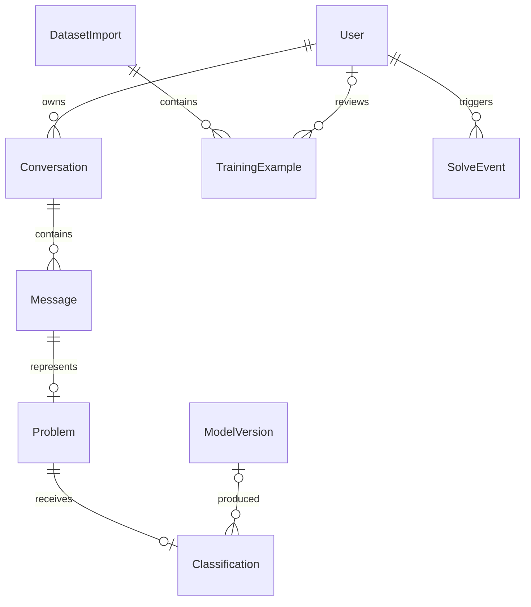

# MathApp data model

The development database is local PostgreSQL. A future hosted backend can use
Neon by changing `DATABASE_URL` and applying the same migrations. Local test data
is not automatically synchronized with production.

## Relationships

- `DatasetImport`: filename, immutable input checksum, original row count.
- `TrainingExample`: full question, proposed/curated label, source, language,
  template group, review status, reviewer and timestamp. Normalized question
  hashes and external IDs prevent duplicate imports. Database constraints reject
  invalid labels, empty questions, or approved rows without review attribution.
- `ModelVersion`: candidate artifact location/checksum, input CSV checksum and
  evaluation report. Registration does not activate a model.
- `Conversation` / `Message`: owner, full message text, role and unique sequence.
  Queries enforce ownership and paginate messages. No lossy compression is used.
- `Problem`: complete extracted question and original input type. For text inputs
  the user message is preserved. For files only extracted text is stored currently;
  uploaded binaries are processed in memory, not retained in the database.
- `Classification`: machine prediction, uncertainty, class scores and version.
  These records NEVER create approved training examples automatically.
- `SolveEvent`: success/failure metadata and a safe error code. Successful OpenAI
  events record provider, model, and provider-reported input/output/reasoning
  token counts when available. No credentials, raw provider errors, or duplicate
  chat text are stored. Price estimates are deliberately absent: model pricing
  can change and unknown usage must remain null rather than becoming a false zero.
- `SolveHistory`: retained compatibility table for the existing frontend. New
  entries link to conversations. Existing history rows remain intact with a null
  conversation link. This temporary duplication should be removed only after a
  tested history migration and frontend update.

## CSV import and review

Run `import_training_csv PATH --dry-run` first. The importer validates the entire
file before writing, then inserts it in one transaction. Exact file reimports are
no-ops. Conflicting IDs/questions reject the complete import, rather than silently
overwriting reviewed data. Imported rows always start pending, even if a CSV
claims approval. Review and correct records through the Django admin.

Export approved rows with `export_training_csv NEW_PATH`. This creates a new
snapshot for training; it does not export private messages. Keep CSV snapshots,
model artifacts, and their reports together to reproduce experiments. Generated
CSV group IDs may not identify all paraphrases; automatic numeric grouping is
only a partial safeguard against train/test leakage.

## Storage and production boundary

Since 2026-09-22, the owner-authorized synthetic training CSV, non-sensitive
exports, model artifacts, and reports are tracked. Review future exports for
private data before committing. Runtime databases, credentials, and private
uploads stay gitignored. Keep backups separately: Git is not a live database
backup. The current scope is local use. Before any future hosted
release, provision managed backups, test a restore, define deletion/retention
policies, and keep any retained PDFs/images in private object storage. Long chats
remain original messages; future context summaries belong in separate versioned
records and must preserve equations and assumptions.

The conversation UI now sends a conversation ID with each follow-up. The backend
selects bounded context from that owner's stored messages. Each assistant message
has analysis metadata and a separate derived memory snapshot; originals remain
unchanged. See [chat.md](chat.md) for context limits and summary limitations.

Problem also stores an optional human-reviewed reference answer/subject with
reviewer and timestamp. This is separate from both OpenAI's subject assessment
and the local classification. Saving a reference does not train the classifier.

Authentication exists, but public registration and paid-call budgets still need
the agreed owner/invited-tester implementation before internet deployment.
