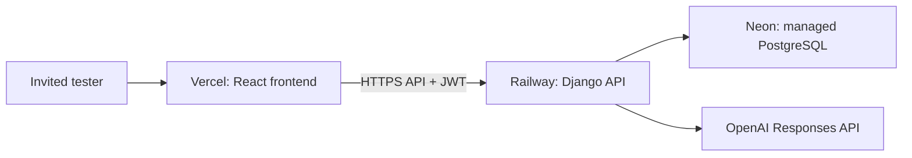

# Hosting plan: Vercel frontend and Railway backend

**Historical plan:** on 2026-09-21 the user chose local-only use. No deployment is
currently planned. See [details.md](../details.md) for the current architecture and
remaining local work. The steps below preserve the earlier discussion and would
need fresh validation if hosting is requested again.

The safe split for MathApp is:

Vercel serves only the compiled React files. Railway runs Django and holds the
server secrets. Neon holds the production PostgreSQL database. Keep
`OPENAI_API_KEY` on Railway only. It must never be a Vercel `VITE_` variable,
because those variables are exposed to the browser build.

## Order of work

1. Finish local testing in PyCharm and create a Git commit.
2. Implement the owner/invited-tester account flow and per-user rate/spend caps.
   Until then, set `ALLOW_PUBLIC_REGISTRATION=false` on Railway.
3. Create a Neon database, place its TLS `DATABASE_URL` in Railway, and run
   `python backend/manage.py migrate` from the Railway deployment command.
4. Add Railway secrets: `SECRET_KEY`, `OPENAI_API_KEY`, `DATABASE_URL`,
   `ALLOWED_HOSTS`, `CORS_ALLOWED_ORIGINS`, and the OpenAI model settings.
5. Deploy the backend, copy its public HTTPS URL, then set Vercel's
   `VITE_API_BASE_URL` to that URL and deploy the frontend.
6. Add the Vercel URL to Django's CORS and CSRF trusted origin settings. Verify
   login, one solve, logout, access control, and a database backup/restore before
   inviting testers.

This document is a plan, not a deployed configuration. The current code still
uses a local experimental classifier artifact (tracked since 2026-09-22); production needs an approved,
non-experimental artifact delivered through private storage or the classifier
must be deliberately disabled. Never copy `data/runtime/` or local database files
to a host.
